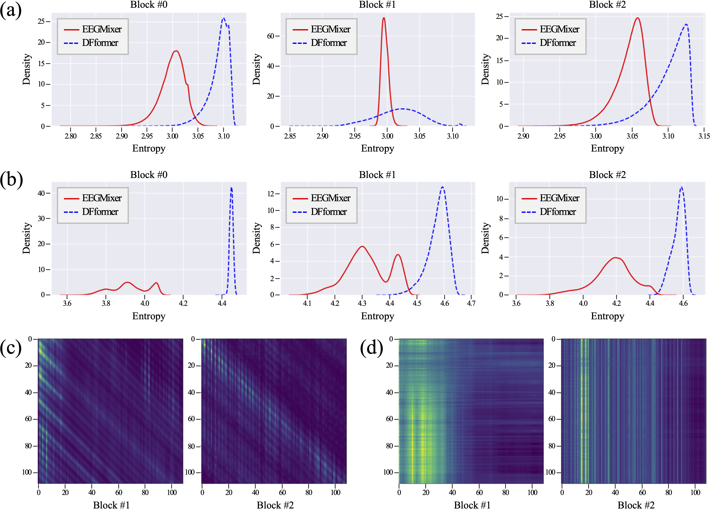
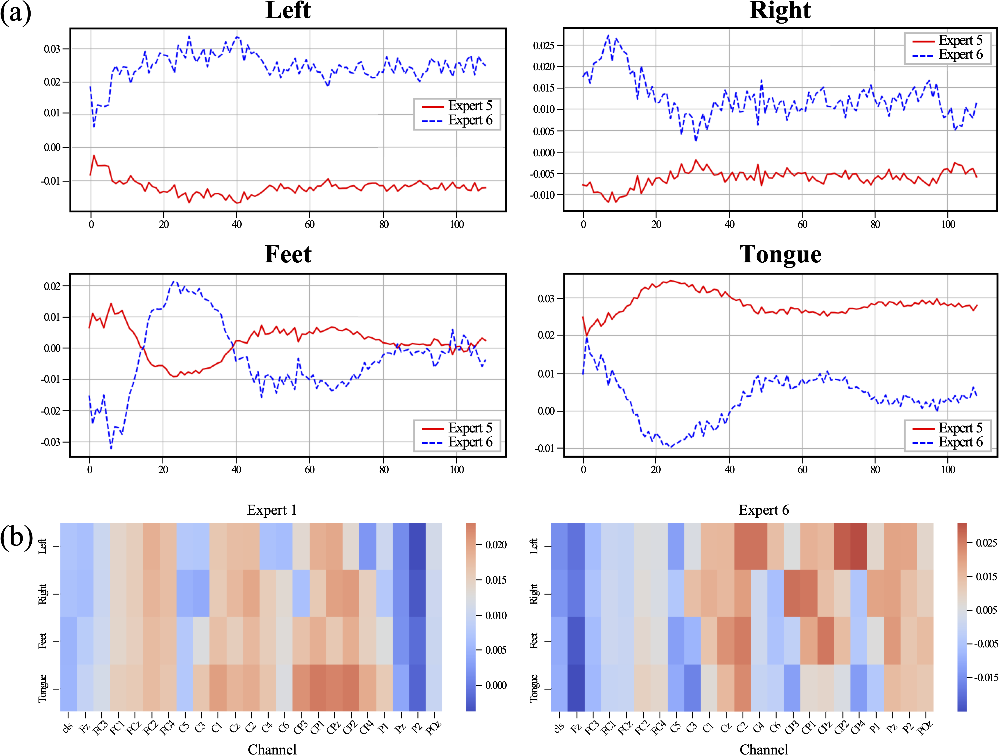

# Train Once, Transfer Anywhere: Toward Device-Homogeneous MI-EEG Decoding

This repository is the official implementations of EEGMixer in pytorch-lightning style:

```text
D.-H. Lee, S.-J. Kim, H. Kong, and S.-W. Lee, "Train Once, Transfer Anywhere: Toward Device-Homogeneous MI-EEG Decoding," 2025. (Under Review)
```

## Architecture

|EEGMixer|EEGMixer Block|
|:-:|:-:|
|||


## Abstract

> Electroencephalogram (EEG) has emerged as a key modality, facilitating the development of brain-computer interface (BCI). Motor imagery (MI), one of the BCI paradigms, has garnered significant attention due to its dual role in motor rehabilitation and daily activity augmentation. Generalizing the decoding of MI-based EEG signals is essential for utilizing BCI systems in real-world environments. While transfer learning facilitates generalization by bridging structural differences across datasets, its deployment is hindered by the challenge of device heterogeneity. While recent studies have attempted to address this limitation, they often require additional preprocessing or dataset-specific architectural modifications. To address these, we propose the EEGMixer that eliminates the need for dataset-specific adaptation. The EEGMixer comprises three key innovations: i) the dynamic spatial hypernetwork for addressing the challenge of device heterogeneity by utilizing a temporally conditioned spatial weight, ii) the mosaic positional encoding that applies absolute and relative encodings along spatial and temporal domains to focus on domain-relevant information, and iii) the orchestration of domain information that extracts informative features by orchestrating EEG representations in spatial and temporal domains and subsequently integrates them to form a unified representation. The EEGMixer achieved competitive performances on each dataset and was extensively validated under six cross-dataset transfer settings across multiple datasets. These demonstrate that the EEGMixer is the first model to enable effective cross-dataset generalization without requiring dataset-specific architectural modifications. Notably, this is the first attempt to validate that a unified architecture can achieve the consistent transferability without the need for dataset-specific adaptation. Hence, we demonstrate the possibility of the EEGMixer to address the challenge of device heterogeneity and enable generalizable decoding across multiple datasets.

## 1. Performance Evalutions

<table border="1">
    <thead>
        <tr>
            <th rowspan="2">Model</th>
            <th colspan="3">BCIC IV–2a (Brunner et al. 2008)</th>
            <th colspan="3">BCIC IV–2b (Leeb et al. 2008)</th>
            <th colspan="3">Zhou (Zhou et al. 2016)</th>
        </tr>
        <tr>
            <th>Acc</th>
            <th>Kappa</th>
            <th>F1-score</th>
            <th>Acc</th>
            <th>Kappa</th>
            <th>F1-score</th>
            <th>Acc</th>
            <th>Kappa</th>
            <th>F1-score</th>
        </tr>
    </thead>
    <tbody>
        <tr>
            <td>ShallowConvNet</td>
            <td>0.5976</td>
            <td>0.4630</td>
            <td>0.5752</td>
            <td>0.7558</td>
            <td>0.5167</td>
            <td>0.7475</td>
            <td>0.6660</td>
            <td>0.4998</td>
            <td>0.6510</td>
        </tr>
        <tr>
            <td>DeepConvNet</td>
            <td>0.5756</td>
            <td>0.4338</td>
            <td>0.5640</td>
            <td><strong>0.7657</strong></td>
            <td><strong>0.5235</strong></td>
            <td><strong>0.7656</strong></td>
            <td>0.5135</td>
            <td>0.2710</td>
            <td>0.4911</td>
        </tr>
        <tr>
            <td>EEGNet</td>
            <td>0.6069</td>
            <td>0.4755</td>
            <td>0.5912</td>
            <td>0.7457</td>
            <td>0.5098</td>
            <td>0.7457</td>
            <td>0.6532</td>
            <td>0.4806</td>
            <td>0.6314</td>
        </tr>
        <tr>
            <td>EEGConformer</td>
            <td>0.5532</td>
            <td>0.4039</td>
            <td>0.5375</td>
            <td>0.7391</td>
            <td>0.4766</td>
            <td>0.7333</td>
            <td>0.7162</td>
            <td>0.5910</td>
            <td>0.7162</td>
        </tr>
        <tr>
            <td>DFformer</td>
            <td>0.5841</td>
            <td>0.4455</td>
            <td>0.5837</td>
            <td>0.7618</td>
            <td>0.5208</td>
            <td>0.7552</td>
            <td>0.7546</td>
            <td>0.6323</td>
            <td>0.7433</td>
        </tr>
        <tr>
            <td>Proposed</td>
            <td><strong>0.6231</strong></td>
            <td><strong>0.4971</strong></td>
            <td><strong>0.6143</strong></td>
            <td>0.7467</td>
            <td>0.4925</td>
            <td>0.7416</td>
            <td><strong>0.7561</strong></td>
            <td><strong>0.6343</strong></td>
            <td><strong>0.7443</strong></td>
        </tr>
    </tbody>
</table>

## 2. Experimental Results in Three Fine-tuning Strategies

<table border="1" cellpadding="4" cellspacing="0">
    <thead>
        <tr>
            <th rowspan="2">Model</th>
            <th colspan="3">BCIC IV–2a (Brunner et al. 2008)</th>
            <th colspan="3">BCIC IV–2b (Leeb et al. 2008)</th>
            <th colspan="3">Zhou (Zhou et al. 2016)</th>
        </tr>
        <tr>
            <th>Acc</th>
            <th>Kappa</th>
            <th>F1–score</th>
            <th>Acc</th>
            <th>Kappa</th>
            <th>F1–score</th>
            <th>Acc</th>
            <th>Kappa</th>
            <th>F1–score</th>
        </tr>
    </thead>
    <tbody>
        <tr>
            <td><strong>Baseline</strong></td>
            <td>0.6231</td>
            <td>0.4971</td>
            <td>0.6143</td>
            <td>0.7467</td>
            <td>0.4933</td>
            <td>0.7418</td>
            <td>0.7561</td>
            <td>0.6343</td>
            <td>0.7443</td>
        </tr>
        <tr>
            <th>Fine–tuning Strategy</th>
            <th colspan="3">BCIC IV–2b → BCIC IV–2a</th>
            <th colspan="3">BCIC IV–2a → BCIC IV–2b</th>
            <th colspan="3">BCIC IV–2a → Zhou</th>
        </tr>
        <tr>
            <td>+ DSH</td>
            <td>0.2635</td>
            <td>0.0183</td>
            <td>0.1463</td>
            <td>0.7358</td>
            <td>0.4718</td>
            <td>0.7165</td>
            <td>0.6882</td>
            <td>0.5339</td>
            <td>0.6315</td>
        </tr>
        <tr>
            <td>+ DSH + Classification head</td>
            <td>0.5214</td>
            <td>0.3613</td>
            <td>0.5062</td>
            <td><strong>0.7609</strong></td>
            <td><strong>0.5213</strong></td>
            <td><strong>0.7567</strong></td>
            <td>0.6952</td>
            <td>0.5428</td>
            <td>0.6815</td>
        </tr>
        <tr>
            <td>Full fine–tuning</td>
            <td><strong>0.6175</strong></td>
            <td><strong>0.4896</strong></td>
            <td><strong>0.6098</strong></td>
            <td>0.7540</td>
            <td>0.5072</td>
            <td>0.7488</td>
            <td><strong>0.7538</strong></td>
            <td><strong>0.6308</strong></td>
            <td><strong>0.7416</strong></td>
        </tr>
        <tr>
            <th>Fine–tuning Strategy</th>
            <th colspan="3">Zhou → BCIC IV–2a</th>
            <th colspan="3">Zhou → BCIC IV–2b</th>
            <th colspan="3">BCIC IV–2b → Zhou</th>
        </tr>
        <tr>
            <td>+ DSH</td>
            <td>0.3532</td>
            <td>0.1370</td>
            <td>0.3061</td>
            <td>0.6890</td>
            <td>0.3770</td>
            <td>0.6838</td>
            <td>0.6472</td>
            <td>0.4826</td>
            <td>0.4960</td>
        </tr>
        <tr>
            <td>+ DSH + Classification head</td>
            <td>0.4959</td>
            <td>0.3274</td>
            <td>0.4809</td>
            <td>0.7222</td>
            <td>0.4432</td>
            <td>0.7155</td>
            <td>0.6970</td>
            <td>0.5455</td>
            <td>0.6883</td>
        </tr>
        <tr>
            <td>Full fine–tuning</td>
            <td><strong>0.6055</strong></td>
            <td><strong>0.4736</strong></td>
            <td><strong>0.5979</strong></td>
            <td><strong>0.7496</strong></td>
            <td><strong>0.4984</strong></td>
            <td><strong>0.7437</strong></td>
            <td><strong>0.7191</strong></td>
            <td><strong>0.5789</strong></td>
            <td><strong>0.7066</strong></td>
        </tr>
    </tbody>
</table>

## 3. Experiments

### 3.1 Visualization of spatial representations learned by the proposed DSH

- (a) Class-wise spatial weights for four MI tasks across four representative indices of the DSS, #7, #19, #39, and #40
- (b) Temporal dynamics of applying spatial weights across a randomly selected index of the DSS, #19


### 3.2 Comparison of the attention entropy-based analysis and the visualization of the attention maps between the EEGMixer and the DFformer

- Distribution of the attention entropy across (a) spatial and (b) temporal domains, respectively. Visualization of the attention maps from (c) the EEGMixer and (d) the DFformer



### 3.3 Visualization of the domain-wise specialization in the proposed ODI

- (a) Class-conditional temporal contribution of the temporal experts in the MOTE across different MI tasks
- (b) Class-wise spatial contribution of the spatial experts in the MOSE across EEG channels
- All visualizations are extracted from the output of Block #1 in the EEGMixer



### 3.4 Expected calibration error (ECE) across different MI tasks and fine-tuning strategies under two cross-dataset settings

<table border="1" cellpadding="4" cellspacing="0">
    <thead>
        <tr>
            <th>Model</th>
            <th>Left</th>
            <th>Right</th>
            <th>Feet</th>
            <th>Tongue</th>
            <th>Avg.</th>
        </tr>
    </thead>
    <tbody>
        <tr>
            <td><strong>Baseline</strong></td>
            <td>0.0800</td>
            <td>0.1230</td>
            <td>0.0900</td>
            <td>0.0540</td>
            <td>0.0868</td>
        </tr>
        <tr>
            <th>Fine–tuning Strategy</th>
            <th colspan="5">BCIC IV–2b → BCIC IV–2a</th>
        </tr>
        <tr>
            <td>+ DSH</td>
            <td>0.0780</td>
            <td>0.2480</td>
            <td>0.1470</td>
            <td>0.1040</td>
            <td>0.1444</td>
        </tr>
        <tr>
            <td>+ DSH + Classification head</td>
            <td>0.0780</td>
            <td>0.0750</td>
            <td>0.0630</td>
            <td>0.0400</td>
            <td>0.0640</td>
        </tr>
        <tr>
            <td>Full fine–tuning</td>
            <td>0.0800</td>
            <td>0.1140</td>
            <td>0.0710</td>
            <td>0.0430</td>
            <td>0.0771</td>
        </tr>
        <tr>
            <th>Fine–tuning Strategy</th>
            <th colspan="5">Zhou → BCIC IV–2a</th>
        </tr>
        <tr>
            <td>+ DSH</td>
            <td>0.0770</td>
            <td>0.0750</td>
            <td>0.1570</td>
            <td>0.1390</td>
            <td>0.1119</td>
        </tr>
        <tr>
            <td>+ DSH + Classification head</td>
            <td>0.0630</td>
            <td>0.0440</td>
            <td>0.0930</td>
            <td>0.1660</td>
            <td>0.0916</td>
        </tr>
        <tr>
            <td>Full fine–tuning</td>
            <td>0.0820</td>
            <td>0.1150</td>
            <td>0.0670</td>
            <td>0.0280</td>
            <td>0.0728</td>
        </tr>
    </tbody>
</table>

